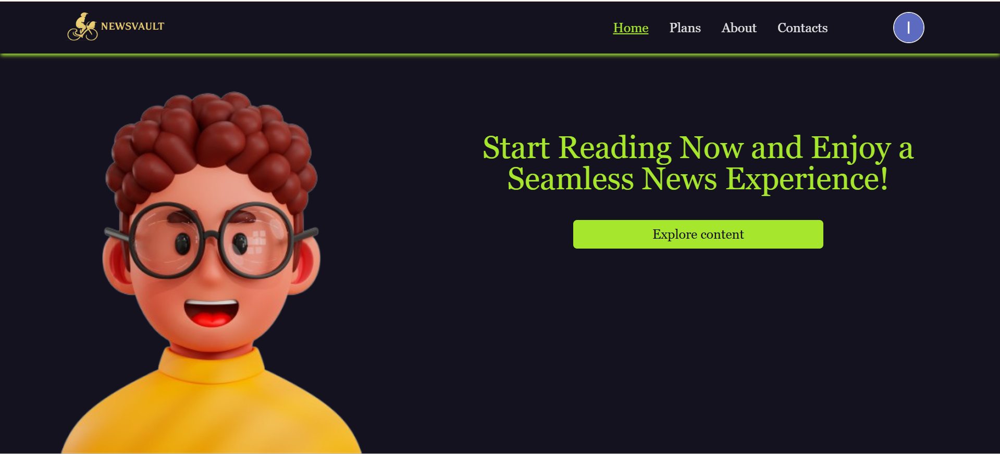
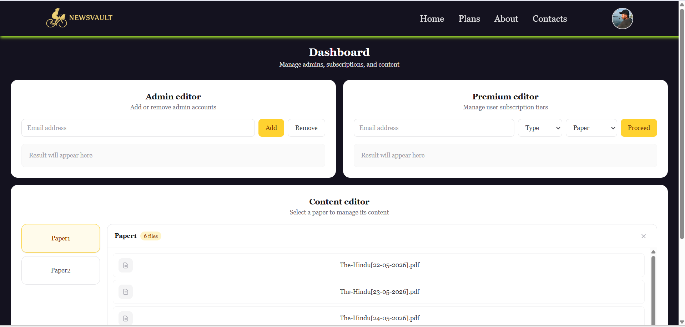
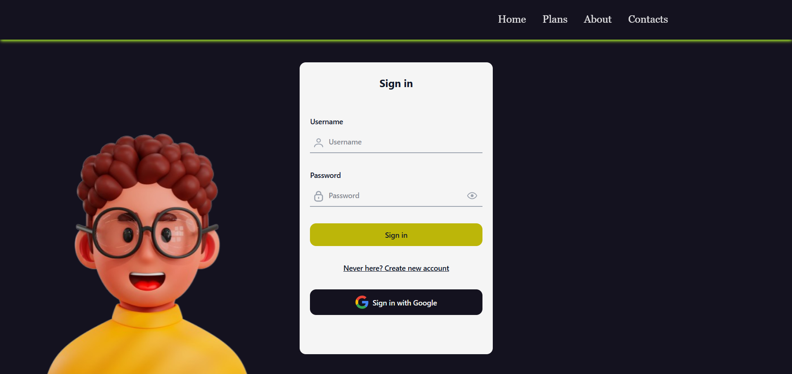
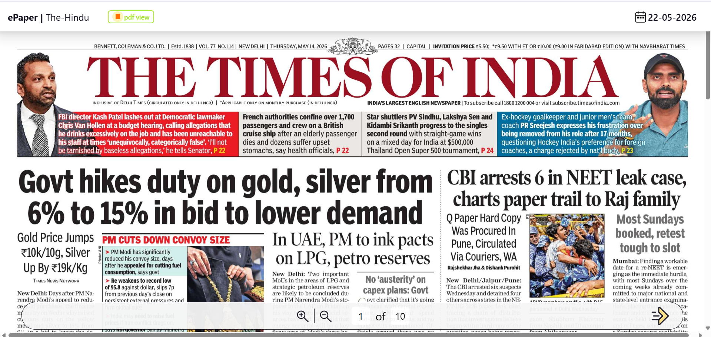

# 📰 NewsVault – Modern News Management & Reading Platform

NewsVault is a full-stack web application built using React (frontend) and Node.js + Express (backend). It allows users to read, manage, and publish news articles with authentication, media upload support, cloud storage integration, and a modern responsive UI.

🔗 Live Website: https://newsvault.laxmansinghrajput.site  
🔗 GitHub Repository: https://github.com/laxmansingh-rajput/NewsVault  
📘 Deployment Guide Repository: <ADD_YOUR_DEPLOYMENT_REPO_LINK_HERE>

---

## 🚀 Features

### 👤 User Features
- Browse latest news articles in real-time UI
- Category-based filtering system
- Read full news content with media support
- Responsive design (mobile, tablet, desktop)
- PDF / media viewer support
- Secure authentication (Login / Signup)
- Profile management system

---

### 🛠️ Admin / Dashboard Features
- Create, update, delete news articles
- Upload images, PDFs, videos
- Content management dashboard
- Premium content control system
- User access control system

---

### ☁️ Backend & Cloud Features
- RESTful API using Express.js
- JWT authentication system
- AWS S3 file storage integration
- Secure file upload handling
- Scalable backend architecture

---

## 🧱 Tech Stack

Frontend:
- React.js
- Vite
- JavaScript (ES6+)
- CSS
- Axios

Backend:
- Node.js
- Express.js
- JWT Authentication
- Multer (file upload handling)

Database / Cloud:
- MongoDB (if used)
- AWS S3 (media storage)

---

## 📁 Project Structure

```
NewsVault/
│
├── src/                        # Frontend React application
│   ├── components/
│   ├── assets/
│   └── main.jsx
│
├── backend/                    # Backend APIs (Node + Express)
│   ├── routes/
│   ├── controllers/
│   └── models/
│
├── public/                     # Static public files
├── assets/                     # Images, icons, media files
│
├── document/
│   └── project report.pdf      # Project Report PDF
│
├── screenshots/
│   ├── home.png
│   ├── dashboard.png
│   ├── login.png
│   └── article.png
│
├── timePass/                   # Experimental / test code
│
├── vite.config.js
├── package.json
└── README.md
```
## 📸 Screenshots

  
  
  


---

## 📄 Project Report

👉 [Open Project Report](./document/projectReport.pdf)

---

## 🚀 Deployment Guide

👉 [Deployment Stragey Repository](https://github.com/laxmansingh-rajput/distributed-cicd-pipeline-jenkins-docker)

---

## ⚙️ Installation & Setup

### Clone repository
git clone https://github.com/laxmansingh-rajput/NewsVault.git  
cd NewsVault  

---

### Install frontend dependencies
npm install  

---

### Install backend dependencies
cd backend  
npm install  

---

### Run project

Frontend:
npm run dev  

Backend:
node index.js  

---

## 🌐 Deployment

Frontend:
https://newsvault.laxmansinghrajput.site  

Backend:
Hosted on AWS / VPS  

Media Storage:
AWS S3  

---

## 🔐 Environment Variables

Create backend/.env:

PORT=5000  
JWT_SECRET=your_secret_key  

AWS_ACCESS_KEY=your_access_key  
AWS_SECRET_KEY=your_secret_key  
S3_BUCKET_NAME=your_bucket_name  

DATABASE_URL=your_database_url  

---

## ⚠️ Security Notes

- Never push .env files to GitHub  
- Rotate exposed OAuth credentials immediately  
- Use environment variables for all secrets  

---

## 📌 Key Highlights

- Modern responsive UI  
- Secure authentication system  
- Cloud-based media storage (AWS S3)  
- Scalable backend architecture  
- Clean modular React structure  
- Production-ready deployment  

---

## 👨‍💻 Author

Laxman Singh Rajput  
GitHub: https://github.com/laxmansingh-rajput  
Live Project: https://newsvault.laxmansinghrajput.site  

---

⭐ If you like this project, please give it a star on GitHub.